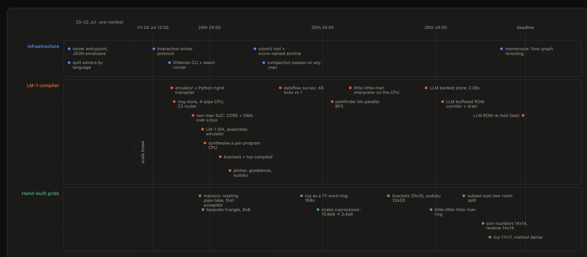
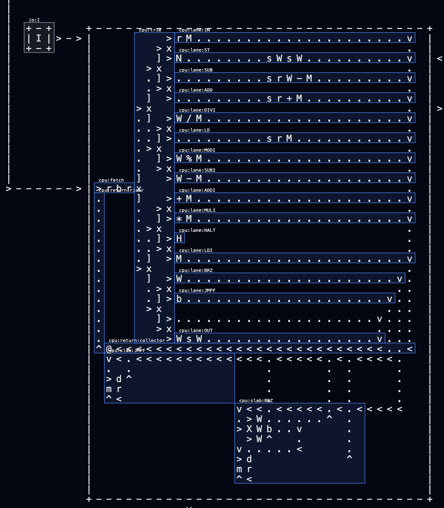
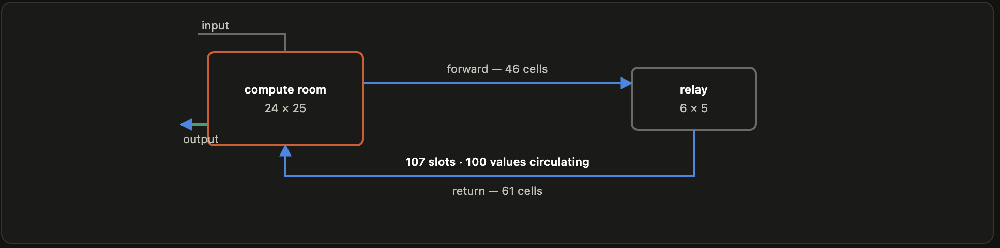
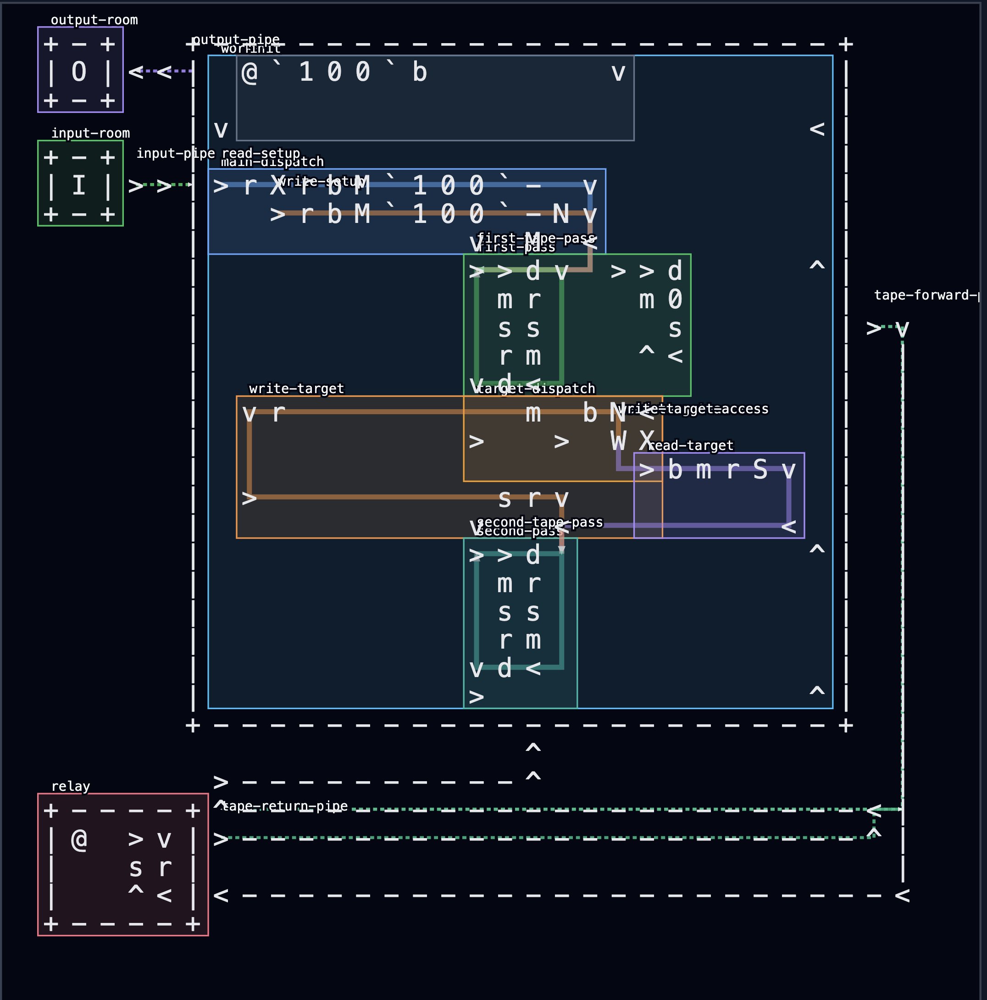
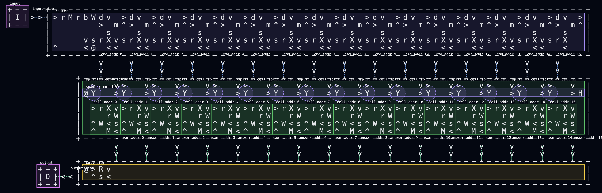
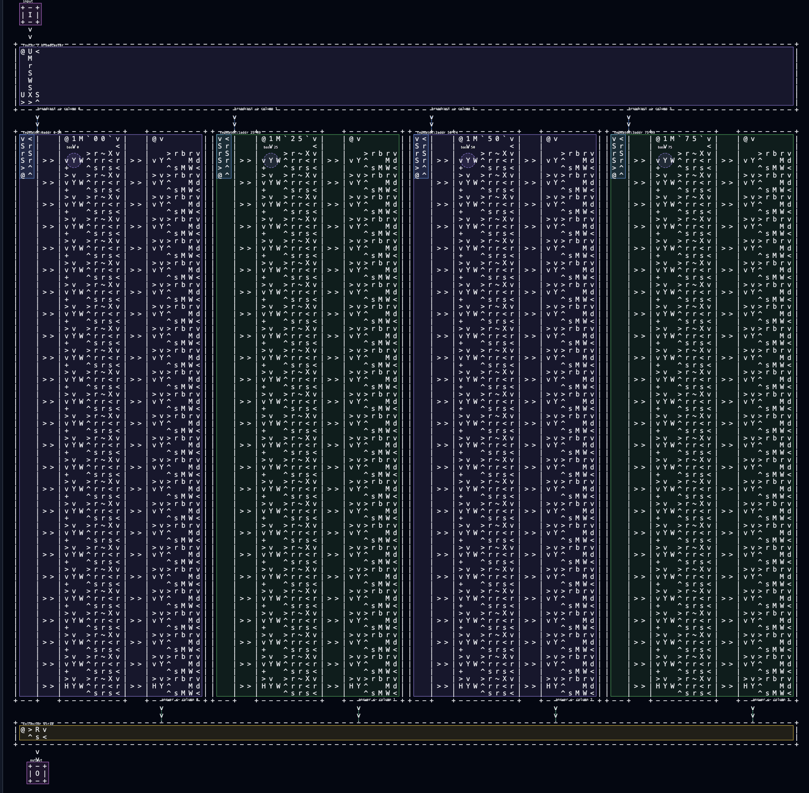
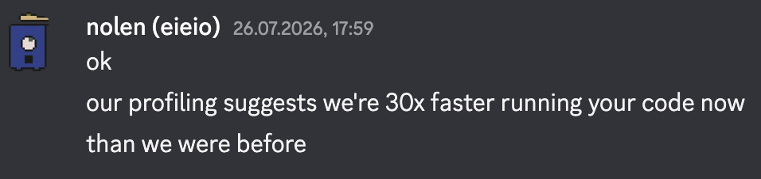
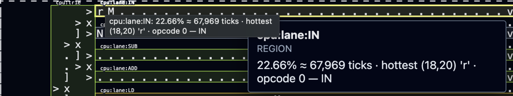

# Lambda Quakens in the ICFP Contest 2026

Hi there, we are team **Lambda Quakens**. Here is our writeup about the participation in the [ICFP Contest](https://icfpcontest2026.com/).
This year we have solved all the 16 problems, and, first time in 4 years we achieved self-owned award for being the first in submitting correct solution for the hardest problem in the contest, and, probably another self-owned award for being the first in that problem till the end of the contest.

# The TASK
The task of this year's contest was to write a program in abstract 2D ASCII language called "littleman".
Almost like a [Befunge](https://esolangs.org/wiki/Befunge) but with a lot of differences. The language is described in the [SPEC.md](littleman/SPEC.md)
Every operation is a glyph that little man has to evaluate by stepping on it. The man can hold two values, and can send information between the rooms through pipes.
The goal of each problem was to write a program that will output expected values for the provided input.
Score of the program is calculated as `max(width, height)² × average ticks`, the squarier and the faster the better.

Spec as we reconstructed it: [`littleman/SPEC.md`](littleman/SPEC.md).
Scoring rules: [`littleman/GRADING.md`](littleman/GRADING.md).

## The Language

While most of the repository is written in Python, I would say that the language of our choice for this contest was actually "Claude" (and some Codex)

## The Approach

Apart from building everything by hand, the main idea was to build a general purpose CPU, and implement it into littleman program. Achieving this we could write any program in a small assembly, and optimize the assembly itself, and not the littleman 2D placement.

So each individual problem was solved in somewhat assembly language, then "encoded" into machine code, and the machine code was basically a list of glyphs that the little man had to step on.

All CPU-based solutions had a common structure, which was:
- "ROM" (Read Only Memory) 
- CPU (Decoder + Executor)
- Memory (Read/Write Memory)
- Optionally - Display (for problems that required it)

First semester problems were too trivial and small to be solved with CPU, but starting from the second semester, all problems were solved with CPU (at first), as a very non-optimized solution. That gave us some points, but gradually through contest all but 1 problem were solved with different approaches.

Approximate timeline of the contest:



## Architecture of each CPU-based solution

### ROM
ROM was basically a result of solving the "History" problem, which was basically designed to exercise the ROM. 

First we implemented fixed width ROM, but then there were several helpers that allowed us to vary the width/height of the ROM, and that allowed us to fit the solution to the smallest size by playing ROM dimensions.

First, very unoptimized fixed size ROM.
```
| v<<<<<<<<<<<<<<<<<<<<<<<<<<<<<<<<<<<@<|
| >.`069`s.`097`s.`115`s.`116`s.`101`sv^|
| vs`301`.s`301`.s`101`.s`230`.s`411`.<^|
| >....................................^|
```

Packed variant:

```
| v<<<<<<<<<<<<<<<<<<<<<<<<<<<<<<@<|
| >`69`s`97`s`115`s`116`s`101`s  v^|
| v s`301`s`301`s`101`s`23`s`411`<^|
| >                               ^|
```

### CPU

Classic CPU architecture with a decoder and executor. The decoder was a big set of `x` and `[` operators, with Read/Write operations on the top right corner, and the JMP operators on the bottom.



A few words on `JMP` and `BNZ` commands. In classical computers, `JMP` is just a change of the instruction pointer. But in our case, with our ROM implementation, the `JMP` instruction to the previous address in ROM was a very expensive operation, since it required rolling through all bytes-1 of the ROM.

Jump operators were dominating on the big problems, and there were a few optimizations like "faster discarding" and "buffering the ROM corridor". In the simplest implementation reading from the ROM takes about 1 character per 6 ticks, which is fine, but not optimal. So the next solution was to implement a "faster" discarding. 

```
a<
rm
rm
>^
```

1 read per 4 tick solution

```
a<
.m
rr
rr
>^
```
1 read per ~2.5 ticks solution.


With that fast read, the next optimization was to implement a buffer for the ROM. 
Buffer was a simple pipe, and it was constantly prefilled by the data from ROM.


### Memory

The memory in this contest often was a bottleneck, since the logical implementation would be a "head", long tape and repeater, which combined, would give you a clear FIFO storage



(check the [memory implementation](littleman/memory.html)) and debugging variant of it (with the debug overlay) [memory-debug](littleman/examples/memory2.debug.html)

This basic approach allowed to scale up a memory to any size, but it was very slow, since in order to access the last element you had to go through all the elements before it.
So, the more memory you had, the slower it was.
Moreover, the rolling of the tape was also a very expensive operation - rolling of 1 element took about 8-10 ticks.



After the lighting round, with the `Y` operator, a new memory implementation was possible, which allowed to have a memory with a constant access time, but with a way bigger footprint.
The idea was to clone littlemans with `Y` operator, and have each of them hold a single value, and then to have a router that would route r/w operation to the right ones.
The biggest win was using `S` and `R` operators - those were basically teleporting values to ALL needed columns, and reading from all the needed inputs from any place in the ROOM.
Usage of those operators allowed to decrease routing time from O(n) to O(k), which was a huge win for the ticks, but the footprint was a lot bigger


#### One Row of memory


#### One grid of memory 4x25



Fun fact - we've used this memory implementation in the last problem, and it was a huge win... on a paper, but in practice, judge system was running out of clock time. That was a bummer, since we were pretty 100% sure that this solution is working, and we tested it locally, but because of some performance issues, the judge system was not able to run it in time.
We notified the contest organizers and they were able to fix the issue, claiming that the new version was 30x faster.



## Emulation and verification

Huge win for us was to copy the emulation and verification code from the contest organizer, basically reusing `littleman.wasm` and `lm.mjs` to run our solutions locally. In the previous years we were always struggling with the reproducing the contest environment, and in this year the brilliant idea of @keenua, one of our team members, saved us a lot of time and effort.

Note, that at some point, we asked our agents to rewrite the solution in the python, but they argued, that solution would not be fast enough, and they decided to write it in pure cpp.
The agent parsed specification, and then easily wrote a cpp version, using the original solution as a reference. 10 times faster, and without OOM on hard problems. 

```
llm-banked-tape (197x192)
  native:  20,000,000,000 ticks in 437s  =  45,750,372 ticks/s
  wasm  :  crashed after 60s (CLI died — the 4 GB Go heap)

history-lesson_base1000 (both engines complete)
  native:  3,821,466 ticks/s        ~10x wall-clock
  wasm  :    373,112 ticks/s  
```


## Debugging
When you are working mostly in the agentic environment, you need to address the issues with the agents, so the debugging info was asked to be provided for each primitive and block, so the agents would get the idea of blocks, without referencing issues on the 2D grid. The idea was to have a solution that will ALWAYS be marked with debug info, and then render it, but in result, almost all of the solutions had "solution" and "solution + debug" versions.
 ¯\_(ツ)_/¯. Anyway. Having this debug info allowed us to address block with the same names, which was used on the construction phase. i.e. "output-pipe", "write-target".

Another nice helper information that we used was heatmaps. By using those we were able to see the "hot" areas of the solution, so optimization there would give us the biggest win.




# An afterword

A lot happened during contest. A lot of things were tried, and a lot of things were learned. This is the first time we went in the "full agentic" mode. In previous years we were always struggling with the implementation of our ideas, and this year we were able to focus on the high level ideas, and let the agents do the implementation and optimization part.
The agents have changed how we are working. In the previous years, people were building pipelines of the solutions, they were starting huge clusters of the servers to run and optimize them.
From one hand, the agents allowed more people to participate in the contest, but the contest idea was big enough to not be solved by a single person or the agent.
I still like programming, I still like the writing lines of code, and while in this year we all were more like "managers" of the agents, a LOT of work was done by the hand. Small optimizations, generation of ideas.
I really appreciate everyone who participated in the contest, and taking my hat off for those who were able to participate without any agents. It was really fun. It just a different type of fun. I still like my ideas to be implemented, but the tooling changed.

It's 4 days after the contest and we are still talking about all of it

Looking forward to the next year, and Big Kudos for all participants and organizers. 


## Can Little Men run DOOM?

**YES!**  
Take a look at the [DEADMAN-3D.md](littleman/DEADMAN-3D.md) 
