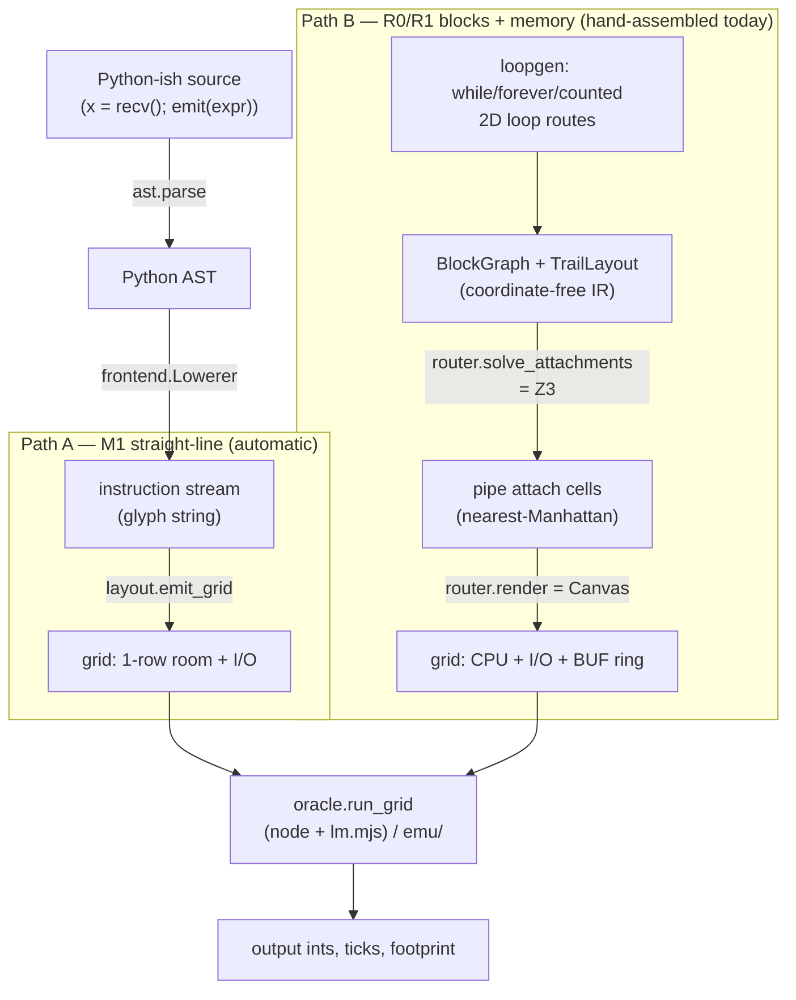

# LMC compiler pipeline — Python-ish → 2D grid

How a program travels from Python-subset source to an ASCII grid the reference
engine (`littleman.wasm` / `lm.mjs`) can walk. This is the *architecture* doc;
`BLOCKS.md` is the catalog of proven blocks, and `examples/README.md` walks the
memory primitives.

The target is an esolang where **there is no linear instruction memory**: a
program is a 2D room of glyphs, a "little man" walks it one cell per tick, and the
glyph under his feet is the instruction. Control flow is *geometric* — glyphs turn
the man; loops and branches are literally routes on the grid. So "compiling" is
two jobs stapled together:

1. **Lowering** — pick the instruction glyphs (a 1D stream). Classic codegen.
2. **2D allocation** — place those glyphs, the rooms, and the pipes on a grid so
   the man's walk executes them in order and every `send`/`recv` hits the right
   channel. This is the part with no analogue in a normal compiler.



Two paths exist because the language grows in milestones:

- **Path A (M1)** is *fully automatic* Python→grid: straight-line integer
  expressions, one pinned variable, no memory. `compile.compile_source` does the
  whole thing.
- **Path B (R0/R1)** adds a **memory ring**, **loops**, and a **Z3 2D allocator**.
  Its programs (e.g. `reverse_list`) are the ones with real control flow. Today
  their `BlockGraph` is *hand-assembled in `demos.py`* — these are the codegen
  *targets* the frontend will eventually emit. The AST→BlockGraph lowering for
  loops/arrays is the open frontier; everything downstream of the IR is built and
  oracle-validated.

---

## 0. The machine you're compiling to

Read this first — every stage below is shaped by these constraints.

- **Registers per man:** `A`, `B` — the only two you compute with; **every ALU op
  is `A = A op B`**. Plus `BP`, a write-only counter/flag (set/decrement/shift/
  branch on it, but you can never read it back into `A`/`B`). All signed 64-bit,
  wrapping.
- **No RAM, no jumps.** State lives in registers, in **pipe cells** (a length-L
  pipe is an L-slot FIFO), or on the display. Memory is *built* from pipes (a
  circulating ring — see `BLOCKS.md` §3). Control flow is geometric.
- **I/O:** ints enter through an `I` room, leave through an `O` room. A program is
  correct the moment its output prefix is correct — it need not halt and **cannot
  detect end-of-input**.

### ISA glyphs (from `lmc/emu/machine.py`)

| glyph | effect | |
|---|---|---|
| `0`–`9` | `A = digit` | load small constant |
| `` `123` `` | `A = 123` | multi-digit literal (backtick-delimited) |
| `M` | `B = A` | copy A→B |
| `W` | `A, B = B, A` | swap (the "W-trick" workhorse) |
| `+ - * % /` | `A = A op B` | `/` also puts remainder in `B` |
| `& \| ~ { }` | `A = A bitop B` | and / or / xor / shl / shr |
| `N` | `A = -A` | negate |
| `> < ^ v` | set heading E/W/N/S | unconditional turns |
| `X` | turn by **sign of A** (`A>0` CW, `A<0` CCW, `A=0` straight) | the branch |
| `b` | `BP = A` | seed the counter |
| `m` | `BP -= 1` | decrement counter |
| `d` | if `BP>0` turn CW (else straight) | counted-loop branch |
| `s` `r` | send `A` / recv into `A` on a **pipe** | blocking; picks pipe by nearest |
| `q` | `A = ` live count of a pipe | length check |
| `H` | halt | |
| `@` | **nop** + man spawn point | ⚠ does *not* reset heading |
| `.` ` ` | nop / floor | |

Two facts drive the whole design: **`X` reads `A`** (so a value-loop counter lives
in `B`, brought to `A` with `W` only to test), and **ring `r`/`s` only touch `A`**
(so `B` and `BP` survive a memory access — that's why `reverse` needs no spill).

---

## 1. Source → AST

Plain `ast.parse` (`frontend.py:220`). The accepted subset (M1):

```python
x = recv()          # optional: one pinned input variable
emit(<expr>)        # one or more; expr over x, recv(), int constants, + - * // % << >> & | ^ unary-
halt()              # optional; auto-appended if missing
```

No custom parser — we lean on CPython's AST and reject (`Unsupported`) anything
outside the subset. Anything needing two simultaneously-live computed values
raises `Unsupported` and is deferred to the memory-ring path.

## 2. AST → instruction stream (lowering)

`frontend.Lowerer` walks the AST and emits glyphs into a `Program` (`.stream` is
the glyph string). This is register allocation for a 2-register machine where you
can only load into `A` and only compute `A = A op B`.

**Model:** keep the one read variable **pinned in `B`**, accumulate in `A`, load
constants into `A`, and let each binary op pull the variable from `B`.

- `x = recv()` → `r` (read into A) then `W` (park in B, A now scratch).
- a `Name` referencing the pinned var → `W` (bring it to A).
- `emit(e)` → lower `e` into A, then `s`.
- **binops** dispatch on operand shape (`_binop`, `frontend.py:100`): `expr op var`
  keeps the var in B and just appends the op glyph; `const op var` loads the const
  into A first; `var op const` for a *non-commutative* op needs the **W-trick**
  (`W M <const> W op`) to get operands on the correct sides once the var dies.
- unary `-` → `N`; constants → `loadconst` (digit, `` `n` ``, or `` `n`N `` for
  negatives).

Worked example — `emit(n*(n+1)//2)` with `n = recv()`:

```
stream:  r W 1 + * W 2 W / s H
         │ │ │ │ │ │ │ │ │ │ └ halt
         │ │ │ │ │ │ │ │ │ └ send A → O
         │ │ │ │ │ │ │ │ └ A = A//B  (A = n(n+1), B = 2  → A = n(n+1)/2)
         │ │ │ │ │ │ │ └ W: A=2's partner … (bring operands to sides)
         │ │ │ │ │ │ └ 2: A = 2
         │ │ │ │ │ └ W: swap so product lands in A
         │ │ │ │ └ *: A = (n+1)*n   (B still = n)
         │ │ │ └ +: A = 1 + n = n+1  (B = n)
         │ │ └ 1: A = 1
         │ └ W: pin n in B
         └ r: A = n
```

## 3. Coordinate-free IR — `BlockGraph` + `TrailLayout`

Once programs need memory and loops, a flat glyph string isn't enough — you need
rooms, pipes, and a 2D trail with turns. The IR (`blockspec.py`, `trail.py`) is
**coordinate-free**: it says *what* exists, not *where*.

- **`Instr(char, pipe)`** — one trail cell; `pipe` names the target channel for a
  `send`/`recv` (resolved to geometry later).
- **`Pipe(id, src_room, src_side, dst_room, dst_side)`** — a one-way FIFO between
  two rooms, attaching on compass sides.
- **`BlockGraph(cpu, rooms, pipes, trail)`** — the CPU room's instruction sequence
  plus the rooms/pipes around it. Knows nothing about `x`/`y`.
- **`TrailLayout`** (`PlacedCell`s) — the CPU trail *shaped* into rows/turns but
  still CPU-relative (interior top-left is `(0,0)`, x east, y south).

`reverse_list`'s IR (`demos.reverse_program`): a 4-pipe CPU (`in`, `out`, ring
`up`, ring `down`) whose trail is three nested loops.

## 4. Loop / branch codegen — 2D routes (`loopgen.py`)

There are no jumps, so a loop is a **rectangular route**: run the body, drop to a
return row below it, walk back west, climb the entry column, and re-enter on a `>`
(never on `@` — `@` doesn't reset heading). `loopgen` builds these as composable
**blocks** (a block is entered at `(0,0)` heading east, exits east on row 0):

- `linear_block(instrs)` — one row.
- `seq_block([...])` — blocks side by side, man flows left→right.
- `while_loop(prologue, test, body, epilogue)` — **test-first, zero-trip**. Row 0
  is `prologue > <test> epilogue`; the last test glyph (`d` on `BP`, `X` on `A`)
  turns clockwise to dive into the body one row down, or goes straight to exit.
  The body's return lane runs below it and climbs back to the `>`.
- `forever_loop(prologue, body)` — `while True:`; body then an unconditional
  wrap-around return lane, **no exit**. This is the outer round loop of a streaming
  program (it never halts — it passes output on). Wiring this into `reverse`
  (commit `dede783`) is what made multi-round test cases pass.
- `counted_loop_trail` — a single `BP` counted loop (`b … m` + `d`).

Because a value-loop uses `B`+`X` while a counted loop uses `BP`, the counters
don't collide, so an outer value-loop can nest a `BP` inner-loop — exactly what
array rotation needs.

## 5. 2D allocation — the Z3 router (`router.py`)

This is the "allocator" the frontend can't do by hand: given the CPU trail and its
pipes, **where does each pipe attach to the CPU wall** so that every `s`/`r` glyph
resolves to the pipe it means?

The engine resolves a pipe op to the **nearest pipe by Manhattan distance**
(reading-order tiebreak). So placement is a constraint problem:

- **Local (Z3), `solve_attachments`:** for each side of the CPU, choose an attach
  cell per pipe such that for every pipe-op cell, its *intended* pipe is strictly
  nearer than every rival pipe of the same direction (send-vs-recv), ties broken by
  reading order. This is tiny quantifier-free linear integer arithmetic (`QF_LIA`)
  and is **origin-independent** (solved in CPU-relative coords), so it scales to any
  pipe count. Unsat ⇒ the trail can't be routed as written.
- **Global (deterministic), `render` + `Canvas`:** place `I` west, `O` east, the
  `BUF` ring north (up + down pipes of length `ring_len`, holding ~`2·ring_len`
  values), and draw straight pipes from the solved attach cells. `BUF` is a
  forwarder loop (`@>rsv / .^..<`) — a memory server is a persistent process.

## 6. Render → grid

`Canvas` rasterizes rooms (walls `+ - |`), the CPU trail, pipes (`> ^ v`), and the
`BUF` block into a sparse cell map, then emits right-trimmed rows. The result is a
`.man` string — the final artifact. `examples/reverse.man` is `render(*reverse_program(), ring_len=9)`.

## 7. Validate — always against the reference

Nothing is "done" until it's walked by the real engine. `oracle.run_grid` shells
out to `node lm.mjs run <grid> --json` (`oracle.py`); a pure-Python mirror lives in
`lmc/emu/` for fast/offline checks. Tests (`tests/`) lock every block byte-for-byte
and run generated programs against the public samples:

- `test_generated_reverse_all_samples` — each list as an independent run.
- `test_generated_reverse_multi_round_streaming` — each named test case fed as
  **one continuous stream** (the real contest shape: 1–3 rounds, next list only
  arrives after the current is printed). Regresses the halt-after-one-list bug.

---

## End-to-end: `reverse_list`

```
Python-ish (target):                    IR (demos.reverse_program):
  while True:                             forever_loop(
    n = recv()                              body = seq_block([
    a = [recv() for _ in range(n)]            push,   # read n, push n values up into ring
    for x in reversed(a):                      emit,  # rotate+extract head n times → O
      emit(x)                               ]))
                                          4 pipes: in(W) out(E) up(N) down(N)
        │ lower (hand-assembled today)          │ loopgen: while/forever + BP rotate
        ▼                                        ▼
  ┌ router.solve_attachments (Z3): place in/out/up/down so each s/r resolves ┐
  └ router.render (Canvas): CPU room + I west + O east + BUF ring north ─────┘
        ▼
```
```
     +---------------------------------+
     |@>rsv                            |          ← BUF: forwarder ring (memory)
     |.^..<                            |
     +---------------------------------+
                 ^                 v              ← up / down pipes (ring_len=9)
                 ⋮                 ⋮
     +---------------------------------+
     |>@rMb>d    >WMX                 v|          ← CPU trail: push-loop, emit-loop
+-+  |      >rsmv   >bm>d    rsWM1-NMv |  +-+          test (X on rem), rotate (d on BP)
|I|>>|     ^    <       >rsmv          |>>|O|
+-+  |                 ^    <          |  +-+
     |           ^                   < |
     |^                               <|          ← forever_loop return lane
     +---------------------------------+
```

Reads `n`, pushes `n` values into the ring, then `n` times rotates `rem-1` and
extracts the head — emitting `x[n-1]…x[0]` — then loops for the next round.
`rem` lives in `B` (survives ring `r`/`s`), the rotate counter in `BP`; no spill,
so it stays a 4-pipe CPU. **All 8 public test cases pass** through `littleman.wasm`.

---

## Where the seam is (current status)

| stage | M1 straight-line | R0/R1 memory + loops |
|---|---|---|
| Python → AST | ✅ `ast.parse` | ✅ (same) |
| AST → stream/IR | ✅ `frontend.Lowerer` | ⛏ **open** — BlockGraphs hand-built in `demos.py` |
| loop/branch codegen | n/a | ✅ `loopgen` (while/forever/counted) |
| 2D allocation | ✅ trivial (`emit_grid`) | ✅ `router` (Z3 nearest-pipe) |
| render | ✅ `layout` | ✅ `router.Canvas` |
| validate | ✅ oracle + emu | ✅ oracle + emu |

The whole *back half* (IR → allocator → grid → validation) is built and
oracle-locked. The remaining frontier is the **AST→BlockGraph lowering** for loops
and array access — teaching `frontend` to emit what `demos` currently writes by
hand (list → ring, `a[i]` → rotate-to-index, `for`/`while` → `loopgen` routes).
See `BLOCKS.md` §4 for the Python-ish → block mapping that lowering will follow.
